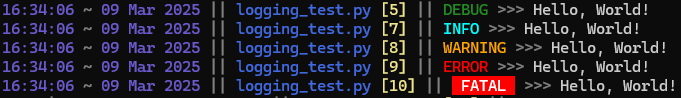
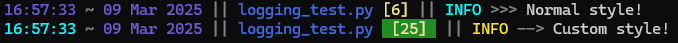
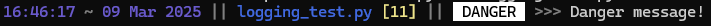

# Pylogger
Simple package allowing for clean, structured, and simple logging in your projects  
*This package is experimental and has not been published to PyPI  
I only coded it for a local project, but decided to share it on GitHub.  
Let me know if you think I should publish it to PyPI.*  



<h2>Features</h2>

- Custom RGB colors customization
- Custom separators
- Custom levels creation
- Logging to files
- Custom loggers with specific log files and prefixes
- Easily wrappable to adjust to your needs


# Installation
To get started, git clone the repository
```
git clone https://github.com/billythegoat356/pylogger
```
Then navigate to it, and install the package locally
```
cd pylogger
pip install .
```

# Usage
# Basic usage

```py
# Import the package
from pylogger import Logger

# Log in info mode
Logger.info("Hello world!")
# 15:53:16 ~ 09 Mar 2025 || logging_test.py [5] ||  INFO  >>> Hello world!

# Log in fatal mode
Logger.fatal("This is a fatal error!")
# 15:53:16 ~ 09 Mar 2025 || logging_test.py [9] ||  FATAL  >>> This is a fatal error!
```

# Set minimum level

By default, the minimum level is set to `Levels.INFO`.

```py
from pylogger import Logger, Config, Levels

# Set the minimum level to warning mode
# Only levels greater or equal than warning will be logged
Config.set_level(Levels.WARNING)

Logger.debug("Hello world!")
# (no output)

Logger.fatal("This is a fatal error!")
# 15:53:16 ~ 09 Mar 2025 || logging_test.py [11] ||  FATAL  >>> This is a fatal error!
```
Only levels greater than or equal to the minimum level will be logged.

# Customize root path

The root path is generally auto-detected at runtime.  
However, like in this example, we can set the root path to a specific directory.  
The path will be logged as relative to the root path.  

*This script was executed from `C:/Users/billy/Desktop/Projects/pylogger/logging_test.py`.*  
```py
from pylogger import Logger, Config

# Set your custom root path
Config.set_root_path("C:/Users/billy/Desktop/Projects/")

Logger.debug("This is logged with your custom root path.")
# 15:53:16 ~ 09 Mar 2025 || pylogger/logging_test.py [6] ||  DEBUG  >>> This is logged with your custom root path.
```
You can also let the root path be detected and set automatically at the current file's root path.
```py
Config.set_root_path() # Leave empty
```

# Log to a file

You can also easily log to a file
```py
from pylogger import Logger, Config

# Set the log file's path
Config.set_log_file("file.log")

Logger.debug("Hey!")
# 15:53:16 ~ 09 Mar 2025 || pylogger/logging_test.py [7] ||  DEBUG  >>> Hey!
```
This logged the message to `file.log`.
**NOTE:** The message will still be logged to the terminal.

# Create logger with prefix

Let's say we want to easily be able to distinguish between which part of our scripts is being logged.  
To do that, it's as simple as creating a **PrefixLogger**.  

```py
from pylogger import PrefixLogger

# Pass the prefix name as arguments
user1_logger = PrefixLogger("user1")
user2_logger = PrefixLogger("user2")

user1_logger.info("User 1 is doing something")
# user1 || 16:10:25 ~ 09 Mar 2025 || logging_test.py [7] || INFO >>> User 1 is doing something

user2_logger.info("User 2 is doing something")
# user2 || 16:10:25 ~ 09 Mar 2025 || logging_test.py [10] || INFO >>> User 2 is doing something
```
You can have a certain logger log to a specific file in the following way:
```py
user1_logger = PrefixLogger("user1", log_file="user1.log")
```
**NOTE:** The prefix loggers will always log to the main log file, if set.  
If a custom log file is given, it will log to this one aswell.  

You can also colorize a logger prefix.  
```py
from pylogger import PrefixLogger
from pylogger.colors import Colors

# Colorize the prefix in red
prefix = Colors.red.colorize("User")
user_logger = PrefixLogger(prefix)

user_logger.info("User is doing something")
# The prefix will be displaid in a red color
# User || 16:10:25 ~ 09 Mar 2025 || logging_test.py [8] || INFO >>> User is doing something
```


# Customize styling
While it is not possible to change the log formatting, you can customize the styling.  
`Colors` contains a bunch of default colors that you can use. You can also create your own ones with `ColorCombo`.  

**NOTE:** Color customization varies across different environments, this might affect how colors are displaid.  
See the example below.  

```py
from pylogger import Logger
from pylogger.styles import Separators, FormatColors
from pylogger.levels import Levels
from pylogger.colors import Colors, ColorCombo, ColorModel

Logger.info("Normal style!")

# Change the separator from level to message
# Default is ' >>> '
Separators.level_message = ' --> '

# Change the time color to 'cyan' as foreground
# Background will be left to transparent (terminal default color)
FormatColors.time = ColorCombo(fg=Colors.cyan)

# Change the lineno color to 'wheat' as foreground, 'forest_green' as background
FormatColors.lineno = ColorCombo(fg=Colors.wheat, bg=Colors.forest_green)

# Create a custom color called 'sunflower'
sunflower_color = ColorCombo(fg=ColorModel(r=250, g=224, b=51))
# Assign it to the info level
Levels.INFO.color = sunflower_color

# Now log to terminal
Logger.info("Custom style!")
```


**NOTE:** If you decide to override a color, you must pass a `ColorCombo` model, since it contains both the foreground and the background.  
`ColorModel` only contains a RGB color. You can pass these models to `ColorCombo` to specify the foreground `fg` and background `bg`.  


# Create a new level
You can log with a custom level specific for your needs.

```py
from pylogger import Logger
from pylogger.levels import LevelModel
from pylogger.colors import ColorCombo, Colors

# Create a new level 'DANGER' with black foreground, white background, with a value of 5
danger_level = LevelModel(
    name="DANGER",
    color=ColorCombo(fg=Colors.black, bg=Colors.white),
    value=5
)
Logger.log("Danger message!", level=danger_level)
```



# Default levels values

- **DEBUG:** 0
- **INFO:** 1
- **WARNING:** 2
- **ERROR:** 3
- **FATAL:** 4

Your custom level will only be logged if it's value is above the one set in the configuration.

# Create a custom logger
If you have some experience, you can easily check out the `logger.py` source code and create your own logger, inheriting from there, with custom prefixes and more.  
Happy logging!  

# Author
billythegoat356
